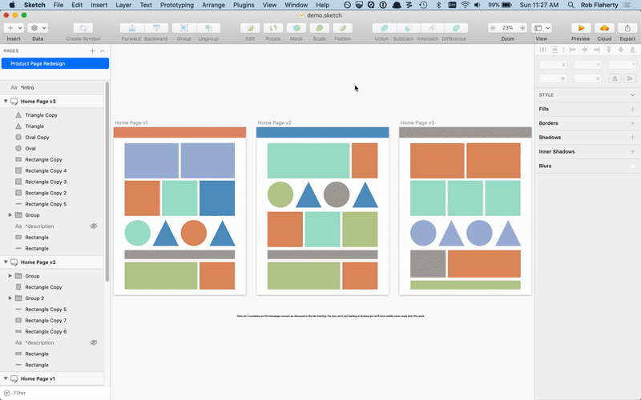

# Sketch Share
This plugin exports all of the artboards on the current page and generates a local HTML index file that links to each one.

This is a beta plugin still under testing. Bug reports welcome.

## How to install
- [Download the latest release](../../releases/latest/download/sketch-share.sketchplugin.zip) of the plugin
- Un-zip and double-click on sketch-share.sketchplugin

## Usage
- Export your artboards with the shortcut **CTRL+Shift+E** or by selecting the Sketch Share command in the plugin menu
- This will export all artboards on the current page as PNGs and create an HTML file linking to each one
- The HTML and PNGs will be saved to `~/Documents/Sketch Exports/`
- The path to the index file will be copied to the clipboard so after exporting you can just paste into a browser
- The name of the Sketch Page will be used for the title of the HTML page
- The artboard names will be used as the link names on the HTML page

## Bonus features
- You can exclude artboards from export by adding an underscore to the beginning of the artboard name
- You can include description text on the HTML page by adding a hidden text layer to each artboard. The name of the layer must be `*description`
- You can include intro text on the page by adding a text layer to the Page (not on an artboard, although that may work). The name of the layer must be `*intro`

## Tips
- Make sure each artboard has a unique name
- The export will respect whatever export settings you have selected for each artboard
- You can change the shortcut to something else by editing the manifest.json file within the plugin
- You can change the styles by editing the html.html file within the plugin

## Future features
- A setting to specify export location
- Auto s3 uploading on export

## Questions/Feedback
[@robflaherty](https://twitter.com/robflaherty)
